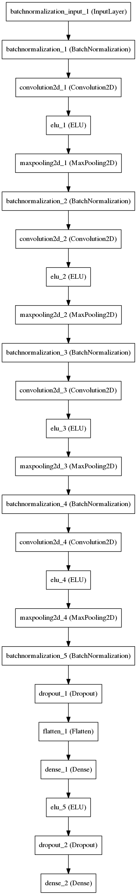

**The problem**

Udacity has provided a driving simulator and a way to record a human driver going around a track. The simulator provides
the left right and center camera images along with angle throttle and speed produced when the human driver goes around the track

The resulting dataset is to be used to train a Keras model that will drive the car around the track in autonomous mode.

**Image augmentation**

The images provided have more information than needed to train the network so
I cropped the image and remove the top 60 pixels to remove most of the skybox. The image was resized to 64x64 and then
fed to the model.

**Model**

The network consists of 4 Convolutional layers and one fully connected layer.

Conv 3x3 24 filters,
MaxPooling layer 2x2,
BatchNorm

Conv 3x3 32 filters,
MaxPooling layer 2x2,
BatchNorm

Conv 3x3 64 filters,
MaxPooling layer 2x2,
BatchNorm

Conv 3x3 64 filters,
MaxPooling layer 2x2,
BatchNorm

Dense 512,
Dropout 0.5

**Training**

I trained for 15 epochs using the provided Udacity data. I added a small offset angle to the left and right camera images
of 0.08 and -0.08 respectively and used it for training. I initially tried with 0.05 but 0.08 seemed to perform better. I also flipped all the
images and angles to extend the training examples.

I used Adam optimizer with learning rate 1e-4, 1e-3 was too high and was not converging well.

When training I put aside 20 percent of the examples as validation set to measure how well the model was generalizing.

**Conclusion**

The model was trained on Track 1 and is able to complete it after training for 15 epochs with the data provided by udacity
however it is not performing well on Track 2. This I think could be improved by augmenting the images further which I have
not done in this example.